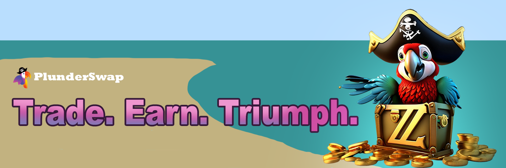

# PlunderSwap


**PlunderSwap offers the trifecta in DeFi crypto experiences:**

**TRADE. EARN. TRIUMPH.**


## Swap

> Instantly swap crypto tokens: no registration or account needed.

### ZilFam's Choice

PlunderSwap is setting sail as the first decentralized exchange on Zilliqa EVM, pioneering a new course in the market's uncharted territories. 

### Lower Swap Fees

PlunderSwap runs on ZIL EVM, a blockchain with much lower transaction costs than Ethereum.\
Trading fees are lower than other top decentralized exchanges too!

### You Own Your Crypto

Trade directly from your wallet app.\
Unlike centralized exchanges like Binance or Coinbase, PlunderSwap doesn’t hold your funds when you trade: **you have 100% ownership of your own crypto**.

### Earn Trading Fees

Earn trading fees when you stake your tokens in Liquidity Pools (LPs).

## Is PlunderSwap safe?

### Transparent:

* We’re built on open-source software: all of our Smart Contracts are publicly visible for maximum transparency.  Of course, swapping and providing liquidity always come with inherent risks.  Please be sure to read our terms and conditions to which you are binded to when using the Platform.

**Sounds like a jolly roger?**\
**Then get plundering, matey!** 🏴‍☠️🦜⚓

***
