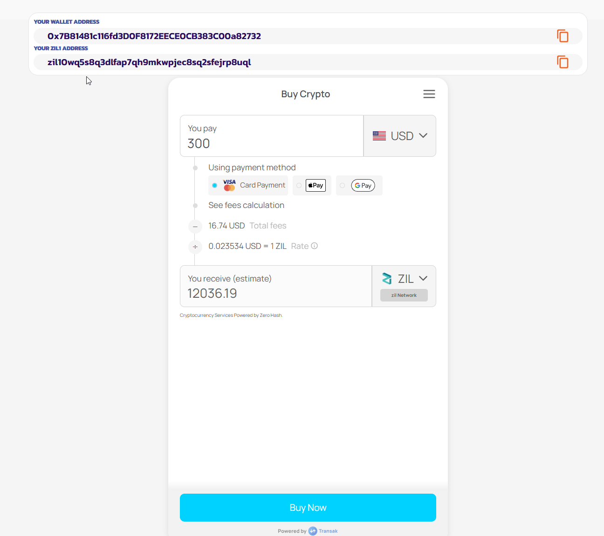

# 💰 Transak - Buy ZIL with Fiat

Buy ZIL with Fiat is a feature that allows users to buy ZIL via a fiat onramp.  Below is a guide on how to use the feature.  Powered by Transak.
see <https://transak.com/global-coverage?crypto=ZIL&network=zil> for more details on supported countries and payment methods.

Please also have a read of <https://transak.com/blog/what-is-crypto-onramp> of what to expect when buying ZIL with fiat.  Some amounts will not need KYC depending on the country, but some will.

## Instructions

1) Go to <https://plunderswap.com/onramp>

2) Connect your wallet

3) NOTE - we show your wallet address and your ZIL1 address, as when you buy ZIL via the fiat onramp, since Transak only support ZIL1 formatted addresses, we will convert and show your ZIL1 address to a ZIL formatted address for you.

4) Select the fiat currency you want to buy ZIL with (We hope to see more ZIL ecosystem tokens in the future!), and the amount of fiat currency you want to buy ZIL with.  This will automatically calculate the amount of ZIL you will receive.

5) Select the payment method from VISA, Apple Pay or Google Pay. (Some countries will also have other options - see <https://transak.com/global-coverage?crypto=ZIL&network=zil> for more details)

6) Click on the Buy Now button

7) Enter your email address and the verification code sent to the provided email address.

8) First-time users may have to undergo a KYC check to comply with global regulations.  Transak’s multi-level KYC feature can help you bypass long processes depending on your region and the amount of crypto you want to purchase.

9) Once your KYC is complete, enter your wallet address (ZIL1 formatted) - we have automatically converted your ZIL1 address to a ZIL formatted address for you, and set this as the default address for you.

10) Finally, complete the payment using your preferred payment method. Transak supports global payment methods like Apple Pay, credit/debit cards, and over 20 local payment methods.

11) Once your payment is received, we will transfer your assets to the provided wallet address. Depending on the blockchain’s network congestion, you should receive your funds in a few seconds or minutes.  You will receive a notification on your email when the transaction is complete.
