# 🔄 Cross-Chain Swap

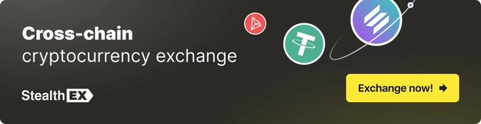

PlunderSwap Cross-Chain Swap is a feature that allows users to swap tokens between different chains. Powered by StealthEx, it enables seamless cross-chain transactions.  Below is a guide on how to use the feature.

### Swapping/Trading

1) Click on the Cross-Chain Swap button on the home page, under the bridge section.

    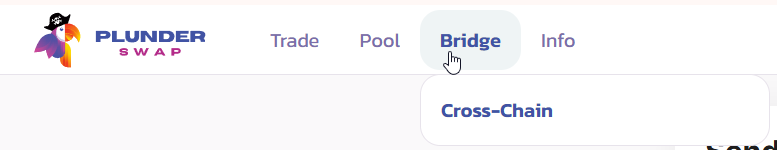

2) Select the token from the source chain you want to swap from the dropdown menu, and the token you want to swap to on the destination chain. and the amount of tokens you want to swap. Click on the Start Exchange button to initiate the transaction.

    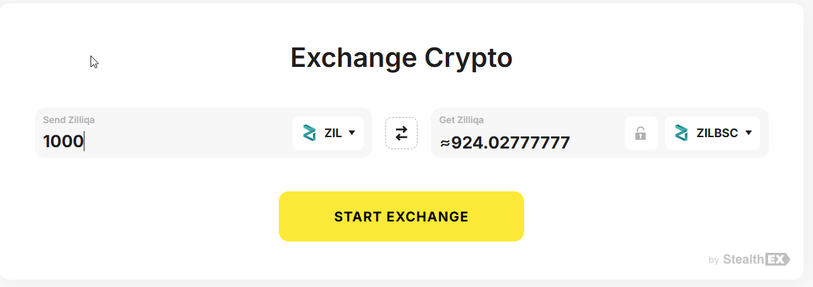

3) Enter the wallet address you want to receive the tokens on the destination chain. Click on the Next button to proceed.  NOTE - this is the wallet address of the destination chain. Click start exchange to continue.

    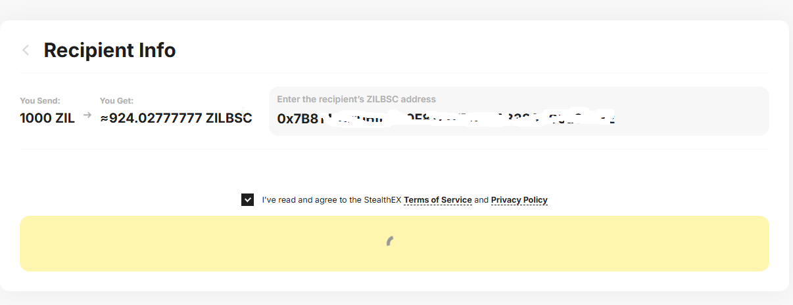

4) You will get a screen saying Awaiting deposit. This is where you will send the tokens (ZIL on the Zilliqa chain in my case) that you want to swap to the destination chain.  This address is specific to this exchange.  In the case of Zilliqa, the default is a ZIL1 address.  Using the little zil1/0x address convertor, you can paste in the zil1 address and find the 0x address to send the tokens to.  Copy this 0x address.

    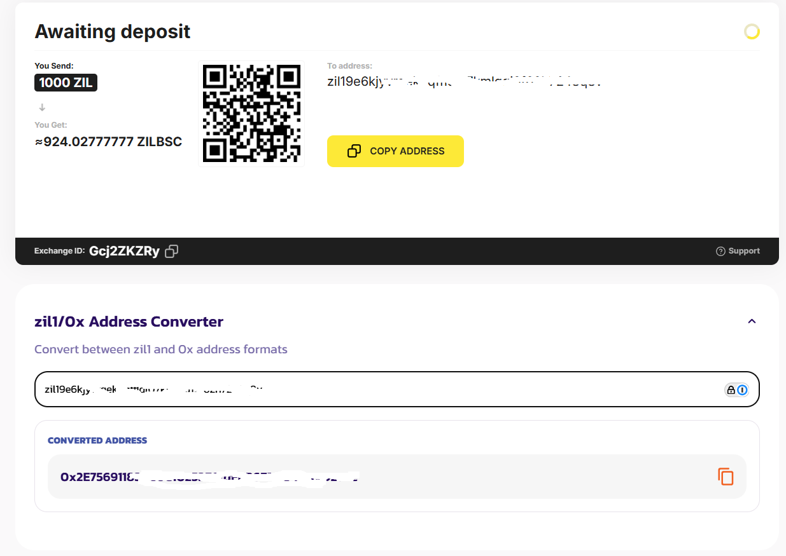

5) Send the tokens to this address using your wallet.  In ths example im using MetaMask.  Ensure you are connected to the Zilliqa chain, and click the send button. In the next screen, paste in the 0x address you copied in step 4.

    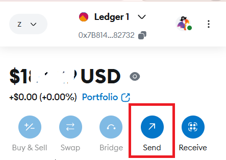

    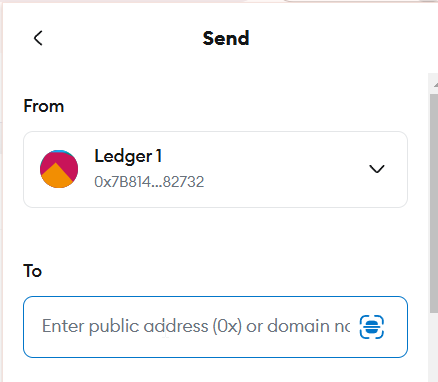

6) Type in the amount of tokens you want to swap which is the amount you entered in step 2.  Click continue button, then finally the confirm button.  You will see in the wallet the pending send transaction, which will eventually be confirmed.

    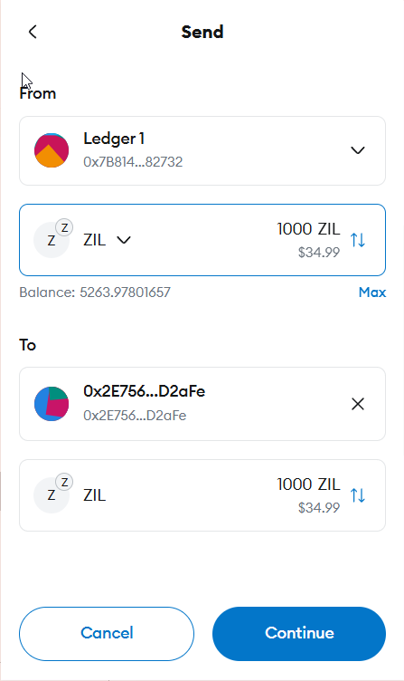

    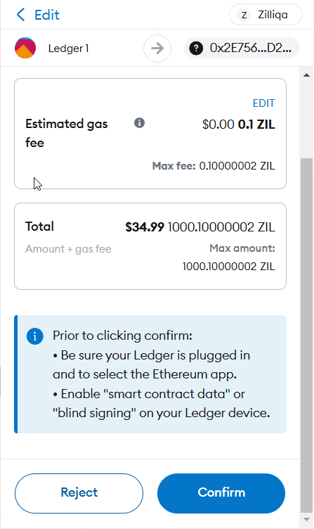

    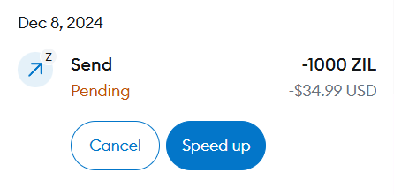

    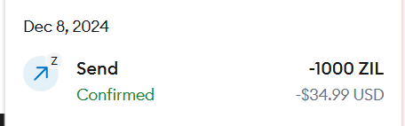

7) You will get the screen saying Confirming. This is where you will wait for the transaction to be confirmed on the source chain.

    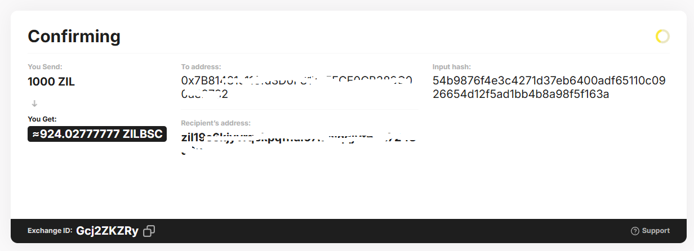

8) Once the transaction is confirmed on the source chain, you will get the screen saying Sending to your wallet. This is where you will wait for the transaction to be sent to your wallet on the destination chain.

    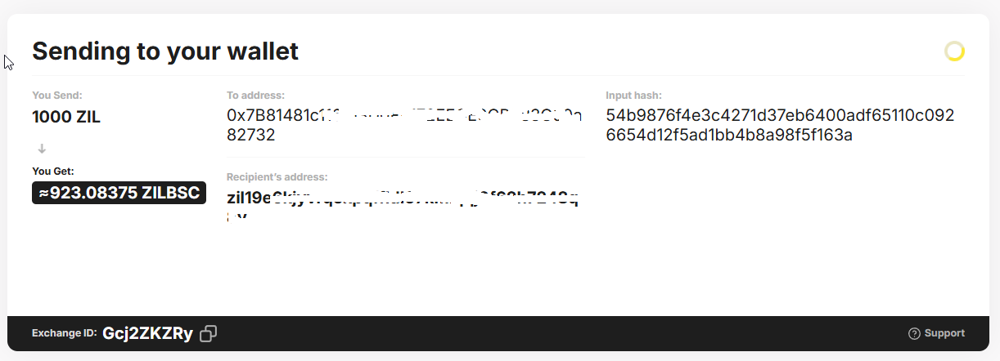

9) Once the transaction is sent to your wallet on the destination chain, you will get the screen saying Finish.  You can now see the tokens in your wallet on the destination chain!

    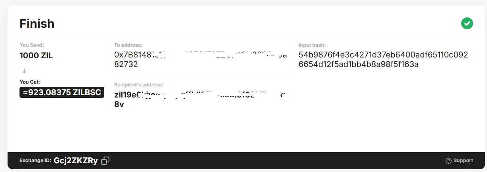

10) To see the tokens on the destination chain, select the chain on the top left of metamask and you will see the tokens in your wallet.  If you do not see the tokens, add the token address for that token on that chain to your wallet.

    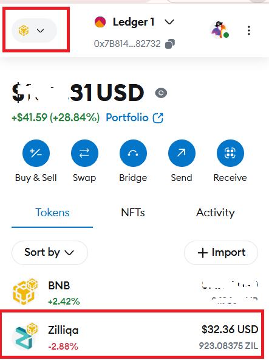
