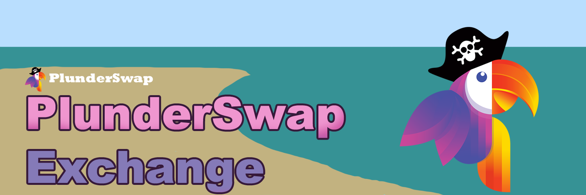

# 🔄 Exchange

PlunderSwap is the first Automated Market Maker (AMM) navigating the waters of Zilliqa EVM. Our Exchange lies at the very core of our voyage. 

The PlunderSwap Exchange unveils a myriad of features designed to support decentralized trading:

### Swapping/Trading

PlunderSwap enables trading without relying on Centralized Exchanges. All actions performed on PlunderSwap are directly channeled through your personal wallet, eliminating the necessity to entrust your coins to a third party.

### Liquidity Pools

You can only trade loot on PlunderSwap if there is enough liquidity for those tokens. In case no one has provided liquidity for the token you intend to swap, the process might be expensive, or even unfeasible.

Supplying liquidity will score you LP Tokens. These tokens reel in rewards in the form of trading fees. It's like collecting spoils for sustaining an ocean of liquidity, allowing the exchange to sail smoothly. 

