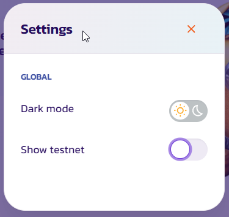

# 🔄 Give TestNet a try!

## Want to give our interface a try in TestNet? 

### Things you will need first
There are a few things you will need to do to test us out!

- Get a wallet installed (Metamask) - see [https://docs.plunderswap.com/get-started/wallet-guide/](https://docs.plunderswap.com/get-started/wallet-guide/)

- and configure it to Zil Testnet - see [https://docs.plunderswap.com/get-started/connection-guide/](https://docs.plunderswap.com/get-started/connection-guide/)

- then, get yourself some test ZILs from Zilliqas Faucet - [!button target="blank" text="**Zilliqa Testnet Faucet**"](https://dev-wallet.zilliqa.com/faucet?network=testnet)

### Then, onto the plundering!!
- Click Here to give it a test! [!button target="blank" text="**Plunderswap TestNet**"](https://plunderswap.com/?chainId=33101)

- Made sure in the top right, the dropdown is selected for Zilliqa Testnet, then click 'Connect Wallet'.  If Zilliqa Testnet doesnt show - click the configuration cog, and click "Show Testnet"

- A window will appear asking you to choose a wallet to connect to. Click **MetaMask** (it's the top option on the list).

- Your wallet will ask you to connect. Tap **Connect** to connect to PlunderSwap.

- Start Trading - a guide to do that - see [https://docs.plunderswap.com/products/plunderswap-exchange/trade-guide/](https://docs.plunderswap.com/products/plunderswap-exchange/trade-guide/)