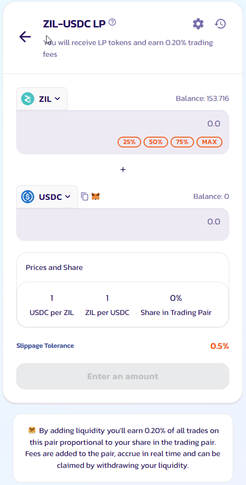

# How to Add/Remove Liquidity

"Liquidity" is central to how PlunderSwap's Exchange works. You can add liquidity for any token pair by staking both through the Liquidity page.

In return for adding liquidity, you'll receive trading fees for that pair.

## Exchange

### Add Liquidity

In this example, we will add liquidity using ZIL and USDC.

1. Visit the [Liquidity](https://plunderswap.com/liquidity) page.

2. Click the “Add Liquidity” button.

3. Using the top left Input, choose the two tokens in the trading pair you want to add liquidity. Here, we are going to use ZIL and USDC as an example.

4. Enter an amount on one of the tokens under “Deposit Amount”. The other should be calculated and filled automatically. If one of the tokens does not have enough balance. You will see an error and the button is greyed out. Please enter a lower amount to proceed or use the “MAX” button to fill in the maximum available value.

5. Click the “Enable xxx” button. If you are adding liquidity against tokens other than ZIL, you might need to click enable twice for each token in your pair. Your wallet will ask you to confirm the action.

6. The “Supply” button will then light up. Click to proceed.

7. Your wallet will ask you for confirmation. Confirm your transaction from your wallet.

### **Remove liquidity**

To remove liquidity.

1\. Visit the [Liquidity page](https://plunderswap.com/liquidity)**.**

2\. Click on the pair you want to remove liquidity from under “Your Liquidity".

3\. Click “Remove”. A new modal will appear.

4\. Use the buttons or slider to choose how much liquidity you want to remove. Choose “MAX” to remove all of your liquidity from this pair.

5\. Click “Enable”. Your wallet will ask you to sign the action**.**

6\. The “Remove” button will light up. Click to proceed.

7\. A window will appear showing how many tokens you will receive. Click “Confirm”. Your wallet will ask you to confirm the action.

8\. After the transaction is confirmed. You will receive two of the tokens from your pair. And if you haven't removed all of your liquidity, your remaining liquidity value will be updated on the liquidity page.\

