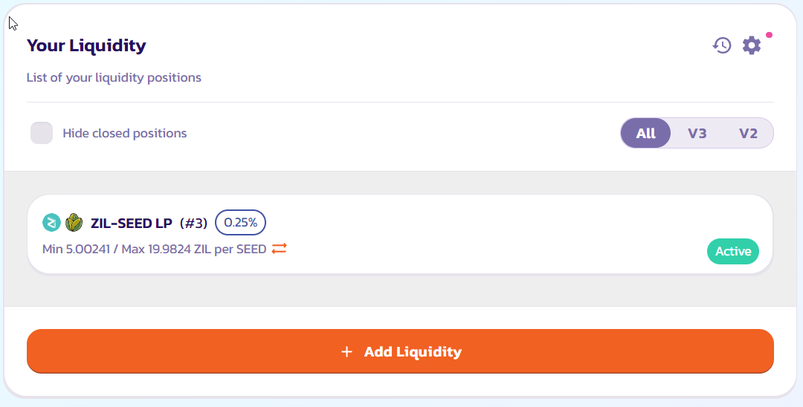
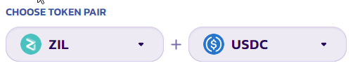
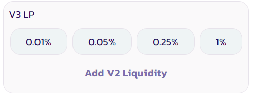
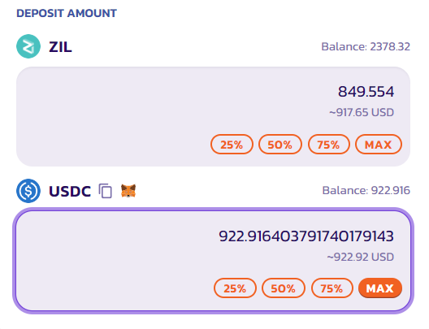
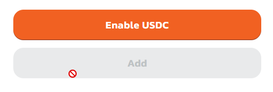
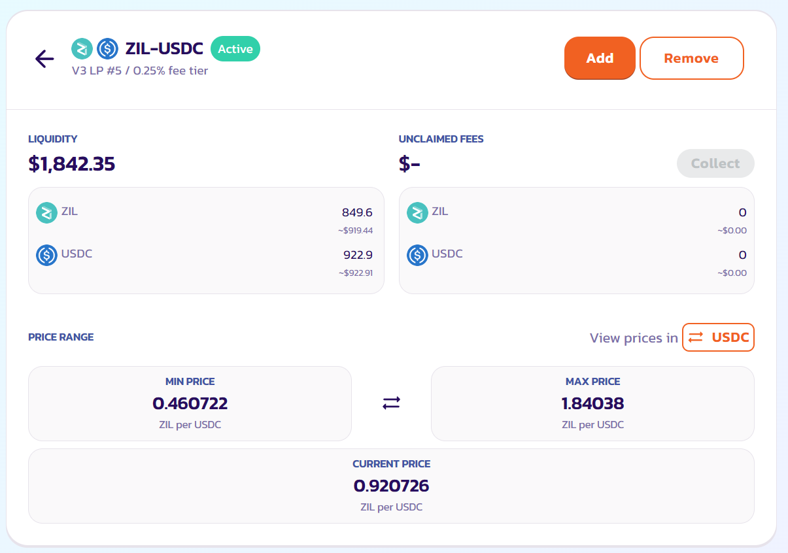
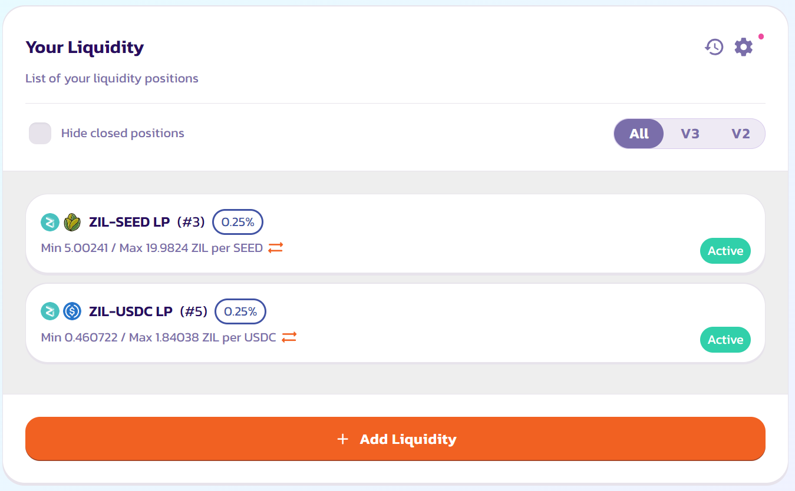
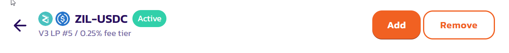
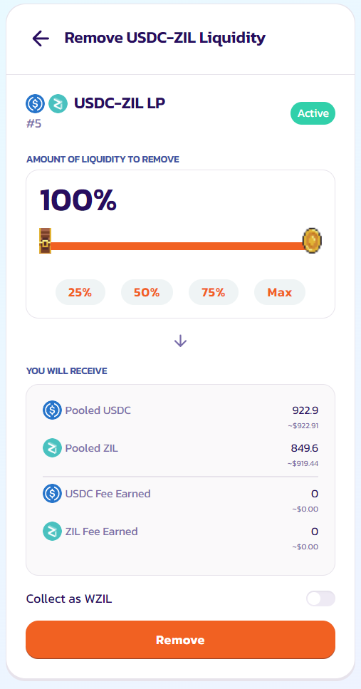

# How to Add/Remove Liquidity

"Liquidity" is central to how PlunderSwap's Exchange works. You can add liquidity for any token pair by staking both through the Liquidity page.

In return for adding liquidity, you'll receive trading fees for that pair.

## Exchange V3

To provide liquidity, you’ll need to commit an amount of any token pair you like. Your lowest value (in USD) of the two tokens will be the limit to the liquidity you can provide.

You can easily trade for any tokens you need. Visit our [How to Trade on PlunderSwap](https://docs.plunderswap.com/products/plunderswap-exchange/trade-guide/) guide if you need to.

In this example, we will add V3 liquidity using ZIL and USDC.

1 - Visit the [Liquidity](https://plunderswap.com/liquidity) page.

2 - Click the “Add Liquidity” button.

3 - Using the top left Input, choose the two tokens in the trading pair you want to add liquidity. Here, we are going to use ZIL and USDC as an example.

4 - Choose the most popular trading fee tier and configure the price range for yourself. 0.25% is the recommended setting, possibly 1% for smaller type tokens.

5 - You can confirm the version as well as the fee tier of the liquidity pool you are providing by looking for the “V3 LP - x% fee tier” displays.

* If you want to customize the fee tier, click “More”, and choose the desired fee tier.
* Please note that it is always advisable to provide liquidity to the most popular fee tier.

6 - You can review and confirm the price range on the right-hand side.

* Although it is not advisable, you can provide your liquidity to the whole price range by clicking the “Full Range” button.  Just a reminder, if the price falls out of your range,
you will no longer be earning fees for that period of time.

7 - Enter an amount on one of the tokens under “Deposit Amount”. The other should be calculated and filled automatically. If one of the tokens does not have enough balance. You will see an error and the button is greyed out. Please enter a lower amount to proceed or use the “MAX” button to fill in the maximum available value.

8 - Click the “Enable USDC” button. If you are adding liquidity against tokens other than ETH, you might need to click enable twice for each token in your pair. Your wallet will ask you to confirm the action.

9 - The “Add” button will then light up. Click to proceed.

10 - Your wallet will ask you for confirmation. Confirm your transaction from your wallet.

11 - Soon after, you will see your new liquidity position on the “My Liquidity” page. And you will be able to check its detail by clicking on the position.

### **Remove liquidity**

To remove liquidity.

1 - Visit the [Liquidity](https://plunderswap.com/liquidity) page

2 - Click on the position you want to remove liquidity from under “Your Liquidity". You may use the filter to quickly check all the V3 liquidity positions.

3 - Click “Remove”. A new window will appear.

4 - Use the buttons or slider to choose how much liquidity you want to remove. Choose “MAX” to remove all of your liquidity from this pair.

5 - Click “Remove” to proceed.

6 - A window will appear showing how many tokens you will receive. Click “Remove” again. Your wallet will ask you to confirm the action.

7 - After the transaction is confirmed. You will receive two of the tokens from your pair. And if you haven't removed all of your liquidity, your remaining liquidity value will be updated on the liquidity page.

## Exchange V2

### Add Liquidity

In this example, we will add V2 liquidity using ZIL and USDC.

1. Visit the [Liquidity](https://plunderswap.com/liquidity) page.
2. Click the “Add Liquidity” button.
3. Using the top left Input, choose the two tokens in the trading pair you want to add liquidity. Here, we are going to use ZIL and USDC as an example.
4. The interface will default to adding V3 liquidity with a few exceptions:
   1. If the trading pair has an active PlunderSwap V2 Farm, it will default to adding V2 liquidity.
   2. If the trading pair has an existing V2 liquidity pool, it will present a “Add V2 Liquidity” link. Simply click to switch to adding V2 liquidity.
5. Confirm you are now adding V2 liquidity by looking for the “V2 LP - 0.25 fee tier” displays.
6. Enter an amount on one of the tokens under “Deposit Amount”. The other should be calculated and filled automatically. If one of the tokens does not have enough balance. You will see an error and the button is greyed out. Please enter a lower amount to proceed or use the “MAX” button to fill in the maximum available value.
7. Click the “Enable USDC” button. If you are adding liquidity against tokens other than ZIL, you might need to click enable twice for each token in your pair. Your wallet will ask you to confirm the action.
8. The “Add” button will then light up. Click to proceed.
9. Your wallet will ask you for confirmation. Confirm your transaction from your wallet.
10. Soon after, you will see your LP Token balance on the liquidity page, among other liquidity positions from V3 and StableSwap.

### **Remove liquidity**

To remove liquidity.

1\. Visit the [Liquidity page](https://plunderswap.com/liquidity)\
2\. Click on the pair you want to remove liquidity from under “Your Liquidity". You may use the filter to quickly check all the V2 liquidity positions.\
3\. Click “Remove”. A new modal will appear.\
4\. Use the buttons or slider to choose how much liquidity you want to remove. Choose “MAX” to remove all of your liquidity from this pair.\
5\. Click “Enable”. Your wallet will ask you to sign the action\
6\. The “Remove” button will light up. Click to proceed.\
7\. A window will appear showing how many tokens you will receive. Click “Confirm”. Your wallet will ask you to confirm the action.\
8\. After the transaction is confirmed. You will receive two of the tokens from your pair. And if you haven't removed all of your liquidity, your remaining liquidity value will be updated on the liquidity page.