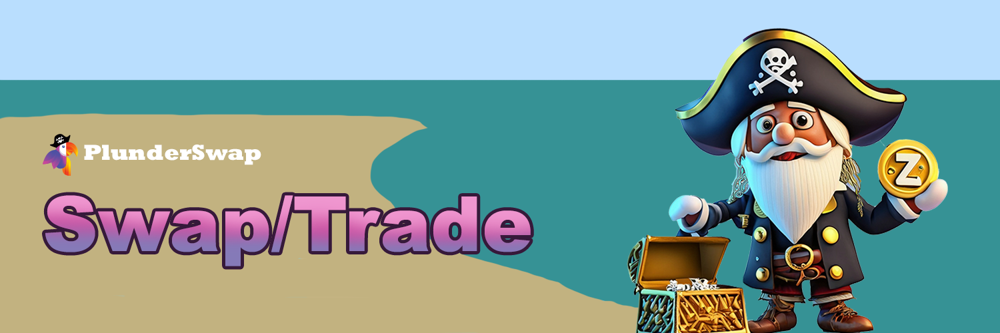

# Token Swaps

[**Token swaps**](https://plunderswap.com/swap) on PlunderSwap are a simple way to trade one token for another via automated liquidity pools on Zilliqa EVM.

Upon executing a token swap (trade) using the Zilliqa EVM PlunderSwap Exchange, you will incur trading fees based on the specific liquidity pool through which your trade is directed. To access route specifics, simply click on the magnifying glass icon within the "Route" section.

A fixed 0.35% trading fee is applied, which is broken down as follows:

* **0.20%** - Returned to Liquidity Pools in the form of a fee reward for liquidity providers.
* **0.15%** - Sent to the PlunderSwap Treasury to keep the vessel sailing smoothly into the future.
